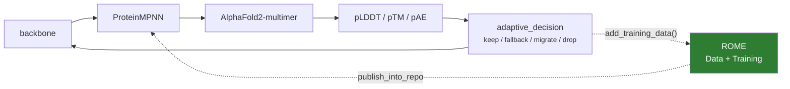

# IMPRESS-R

IMPRESS runs backbone → ProteinMPNN → structure prediction → pLDDT/pTM/pAE →
keep/fallback/migrate/drop. It is **open loop**: each campaign improves the
designs, never the model. Every campaign starts from the same public ProteinMPNN
weights, no matter how much the previous one learned.

**IMPRESS-R** adds ROME so the campaign's own highest-confidence sequences
fine-tune ProteinMPNN mid-campaign, and the improved model returns to the
pipeline. **IMPRESS itself runs unchanged.**



Four examples, in order of how much of the real campaign they involve. The
trainer deep-dive is in [Fine-tuning ProteinMPNN](../proteinmpnn_training.md).

## The four calls against a stand-in pipeline

`examples/agnostic/impress_r.py` — **start here if you don't have IMPRESS installed.**

`run_impress_cycle` stands in for the pipeline and runs unchanged. ROME is four
calls — build a manager, contribute, collect, stop — with no IMPRESS dependency.

```bash
dragon examples/agnostic/impress_r.py
```

## The integration tests

`tests/unit/test_impress_r_hooks.py` and `tests/integration/test_impress_r.py`
cover the seam between ROME and a real `ImpressManager`/`ImpressBasePipeline`
with stubbed executables. These skip automatically when IMPRESS is absent and run
on any machine with IMPRESS installed — no GPU, no allocation:

```bash
pytest tests/unit/test_impress_r_hooks.py tests/integration/test_impress_r.py -v
```

The key invariant they verify: `adaptive_decision(pipeline)` is the seam. It runs
after the pLDDT-extraction task of every pass — the one point where the campaign
both *has* fresh scored designs and is *between* passes. `run()` never mentions
ROME, and the degradation logic that spawns child pipelines is IMPRESS's own,
untouched.

## The real campaign

`examples/impress_r/protein_binding/run_protein_binding_rome.py`

IMPRESS's own protein-binding pipeline —
MPNN → AlphaFold → pLDDT extraction, the migration logic, all of it — with the two
ROME calls added inside `adaptive_decision` and nothing else changed. Submit it
on Delta via `bash submit.sh` (see [Setting up on Delta](../delta.md)).

### Hook 1: contribute

```python
src = os.path.join(pipeline.output_path_af, f'{protein}.pdb')
staged = os.path.join(stage_dir, f'{pipeline.name}_pass{pipeline.passes}_{protein}.pdb')
shutil.copyfile(src, staged)

uid = rome_manager.add_training_data(
    path=staged,
    sequence=sequence,
    backbone_id=protein,
    pLDDT=float(row['avg_plddt']),
    pTM=float(row['ptm']),
    pAE=float(row['avg_pae']),
    score=float(row['avg_plddt']),
)
```

!!! warning "Stage the structure before recording it"

    The prediction at `output_path_af/{protein}.pdb` is keyed by **pipeline, not
    by pass**, and it is deleted on migration. Recording that path directly would
    leave the corpus pointing at a file whose contents change under it — or that
    vanishes before the round runs. Copy it aside first.

    This is the kind of detail that only shows up against a real campaign, which
    is why this example exists alongside the stubbed one.

### Hook 2: collect

```python
weights = rome_manager.get_current_model()
```

With `publish_into_repo=True` the trainer writes the new weights straight into the
ProteinMPNN checkout's `vanilla_model_weights/`, so **the next MPNN pass picks
them up with no wrapper change**. Hook 2 is therefore only reporting what ROME
currently has — the handover already happened.

### Wiring

```python
rome_backend = await _make_backend()
rome_manager = rome.Manager(
    backend=rome_backend,
    data_config=rome.DataConfig(
        min_samples=int(os.environ.get('ROME_MIN_SAMPLES', 4)),
        sample_func=percentile_sampler(0.33),
    ),
    trainer_config=rome.TrainerConfig(
        trainer=_build_trainer(...),
        checkpoint_dir=os.path.join(workdir, 'checkpoints'),
        poll_interval=1.0,
        result_fallback_seconds=float(os.environ.get('ROME_FALLBACK', 60)),
    ),
)
await rome_manager.start()
```

Three choices worth copying:

**ROME gets its own process-based backend.** Not IMPRESS's engine, and not the
in-process default — a fine-tune's GPU allocation would otherwise stay resident in
the campaign driver for the whole run. See
[Execution](../design/execution.md#why-a-gpu-round-should-be-a-command).

**`min_samples` is small.** The campaign contributes roughly *one scored design
per pipeline per pass*, so the corpus grows slowly. A threshold tuned for an LLM
campaign would never fire.

**`percentile_sampler(0.33)`, not a threshold filter.** IMPRESS's own pLDDT/pTM/pAE
cutoffs are useless as an admission filter here, because everything reaching the
score CSVs has already cleared them — the filter would be applied downstream of
itself. And the campaign data available was produced with Boltz while the targeted
branch runs AlphaFold2-multimer, and the two predictors do not share a confidence
scale. A fraction needs no scale. See
[Percentile sampling](../guide/data.md#percentile-sampling-when-you-dont-know-your-thresholds)
and [what data a round needs](../proteinmpnn_training.md#3-what-data-a-round-needs).

### Other pipeline wiring details

Two IMPRESS-specific patterns that fall out of the real integration:

* **`auto_register_task(local_task=True)`** leaves the decorated function as a
  plain Python call rather than wrapping it as an executable task. Any step that
  must run in-process (reading shared state, spawning child pipelines) takes this
  form.
* **`PipelineSetup(kwargs={...})`** passes arbitrary configuration through to
  the pipeline constructor. The example uses it to thread `base_path` through
  without modifying the pipeline class.
* **`post_exec` only runs on `RadicalExecutionBackend`** — silently ignored on
  `LocalExecutionBackend` and the Dragon backend (the only options on current
  asyncflow). The archive `run_protein_binding.py` used `post_exec` to copy
  AlphaFold's ranked model into `best_models/`; if that step is absent, AlphaFold
  fills `dimer_models/` but `best_models/` stays empty and the pLDDT extractor
  writes a header-only CSV. `run_protein_binding_rome.py` avoids this by folding
  the copies into the AlphaFold task's own shell command.

## Seeing it in the log

ROME's log lines are formatted to match IMPRESS's, so the two interleave
readably in one campaign log:

```text
12:34:56.789 [INFO] [PIPELINE-P1]  pass 3 complete
12:34:56.812 [INFO] [ROME-DATA]    received design 8oep (score=95.0) — corpus 8 (8 unconsumed)
12:34:57.001 [INFO] [ROME-TRAINER] submitting training round 1 (8 designs, trainer mpnn) -> v1
12:35:44.512 [INFO] [ROME-MODEL]   published v1 (8 designs) -> .../vanilla_model_weights/v_48_020.pt
```

See [Logging](../guide/logging.md).

## Campaign structure

`examples/impress_r/` is organised by use case:

```
impress_r/
  submit.sh                              — launch wrapper (sets --job-name for log routing)
  delta_gpu_run.sh                       — unified SLURM batch script
  delta_env_setup.sh                     — unified ROME addon installer
  README.md                              — env vars, quick commands, log prefixes
  skill.md                               — reward functions, filters, checkpoint guide
  protein_binding/
    run_protein_binding_rome.py          — entry point
    mpnn_trainer.py                      — ProteinMPNNTrainer + pb_reward_fn
    mpnn_train_wrapper.py                — fine-tune CLI (dragon-free, runnable standalone)
    mpnn_stream.py                       — inference stream with hot-swap weights
  small_molecule_binding/
    run_smb_rome.py                      — entry point
    ligandmpnn_trainer.py                — LigandMPNNTrainer + smb_reward_fn
```

## API reference

* [`examples.impress_r.protein_binding.mpnn_trainer`](../api/examples/impress_r/protein_binding/mpnn_trainer.md) —
  `ProteinMPNNTrainer`, `ProteinMPNNConfig`, `percentile_sampler`,
  `impress_corpus_filter`, `build_chain_designation`
